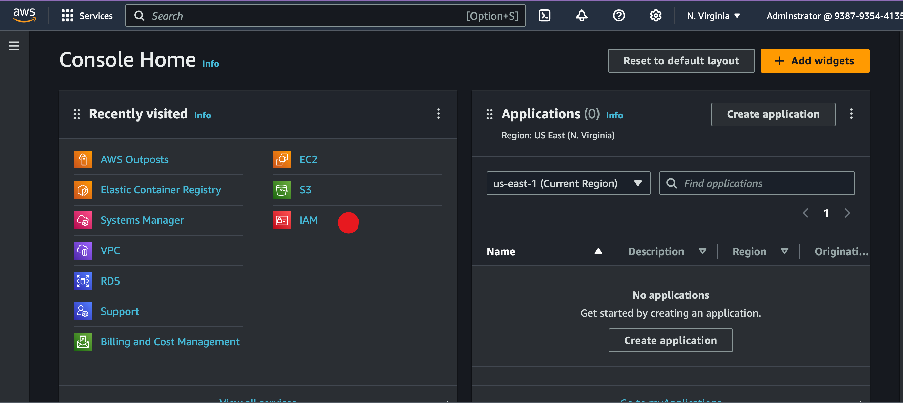
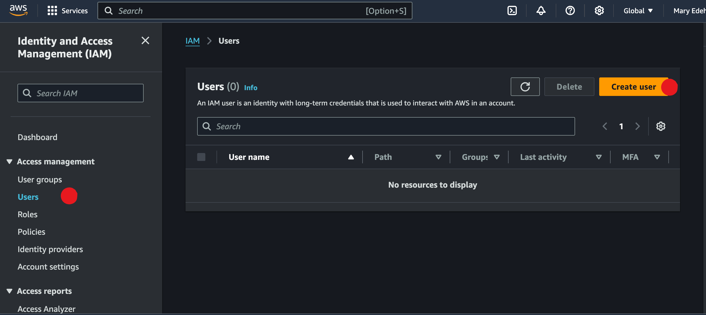
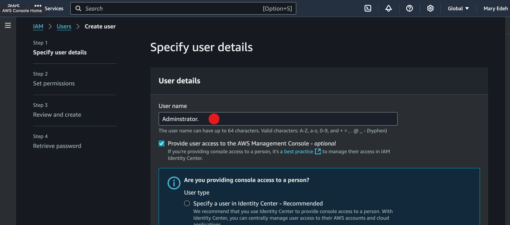
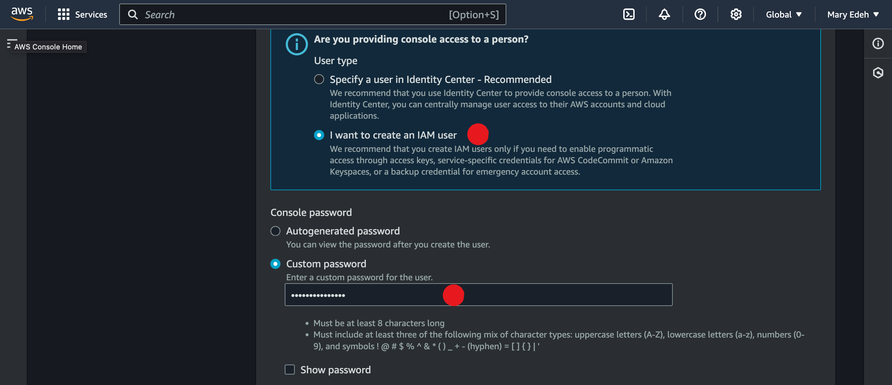
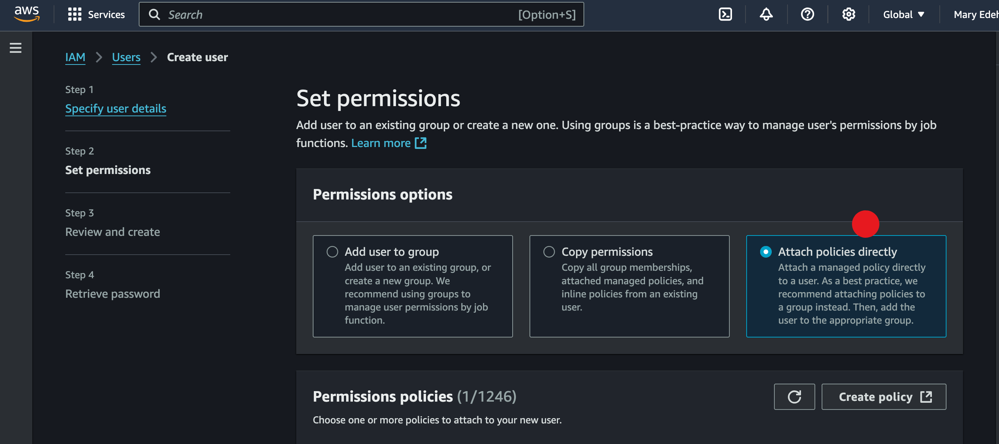
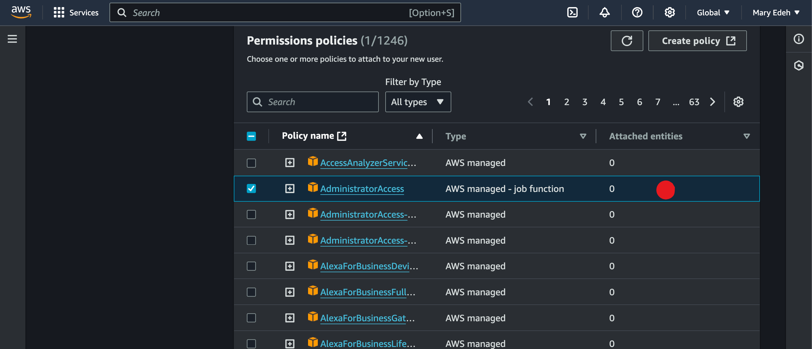
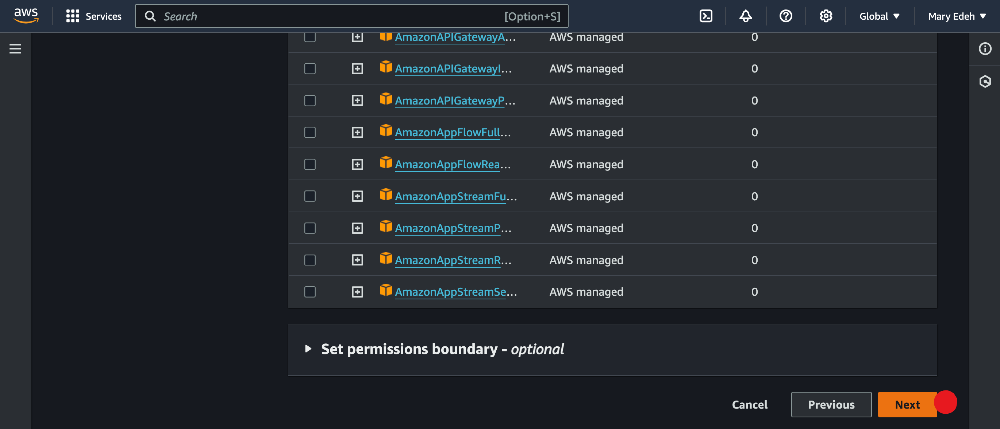

# create_an_IAM_user_on_AWS

- Start with creating a AWS Account
- From the log in page, sign in as the root user with password.
- Then proceed to the IAM console.
  
- From the left sidebar of the IAM Console, click **Users** and then click **Add user**
  
- Enter User name as **Administrator.**
  
- Tick **Provide user access to the AWS Managemen** Console check box.
- Choose **I want to create an IAM user**
- - Choose Custom password and enter a password of your choice. 
- Uncheck the Users must create a new password box. 
  
- Click Next.

# Set Permissions.
- Choose **Attach policies directly**,
  
- tick **AdministratorAccess** option.
- 
- Then click **Next.**
  
- Review and create user.
- Copy the URL or download the cvs file.

Log out from the **root user** and then log in to the **Administrator user** you just created using the URL you copied above.
