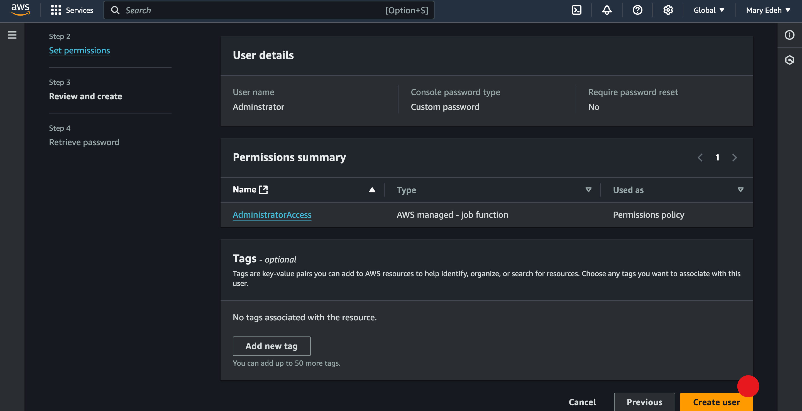
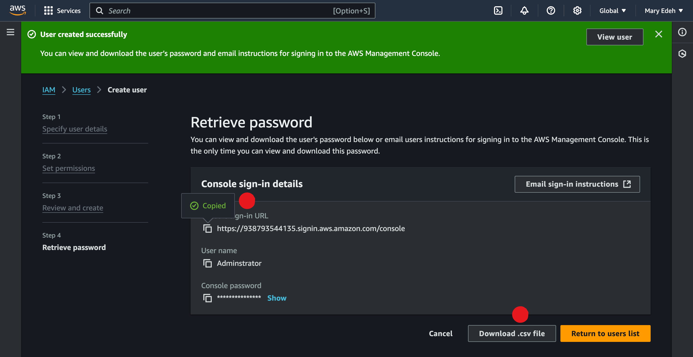
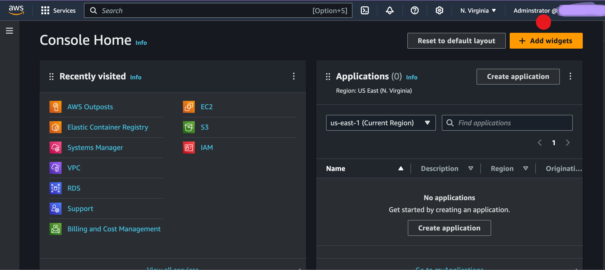

# create_an_IAM_user_on_AWS

**WHO IS AN IAM USER?** - an IAM (Identity and Access Management) user is an entity that you create to represent an individual person or application that interacts with AWS resources. IAM users are part of AWS’s access management system and can be assigned permissions to access and manage AWS services and resources.

**Let's create Adminstrator as an IAM user.**

- Start with creating a AWS Account
- From the log in page, sign in as the root user with password.
- Then proceed to the IAM console.
  
- From the left sidebar of the IAM Console, click **Users** and then click **Add user**
  
- Enter User name as **Administrator.**
  
- Tick **Provide user access to the AWS Managemen** Console check box.
- Choose **I want to create an IAM user**
- - Choose Custom password and enter a password of your choice. 
- Uncheck the Users must create a new password box. 
  
- Click Next.

# Set Permissions.
- Choose **Attach policies directly**,
  
- tick **AdministratorAccess** option.
- 
- Then click **Next.**
  
- Review and create user.
  
- Copy the URL or download the cvs file.
  
Log out from the **root user** and then log in to the **Administrator user** you just created.

# Conclusion.

We have created IAM user to perform tasks, instead of performing tasks directly with root user.
